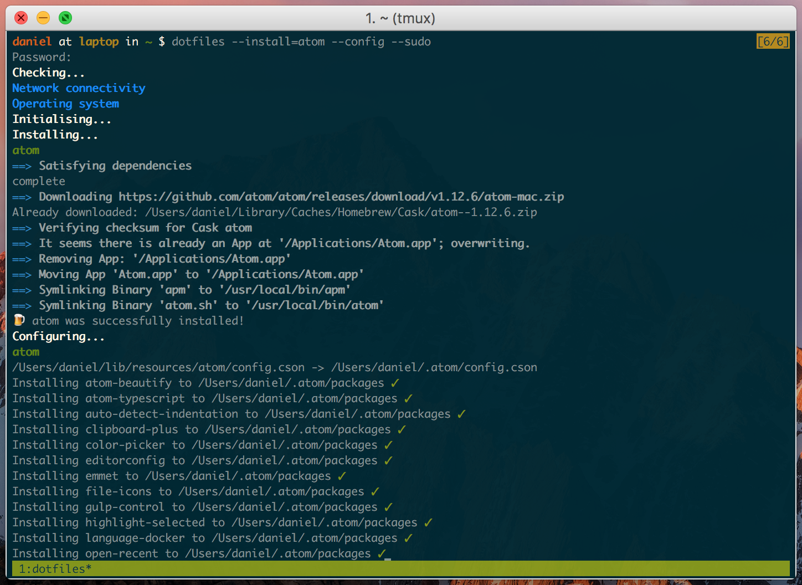

Dotfiles
========

The aim of the `dotfiles` project is to configure Bash to provide a better user experience while using the command-line.

Supported operating systems are:

* Mac OS X
* Ubuntu

However, most of the scripts should work well on the other Linux distributions. If the installation ends with a message _"Operating system not supported"_ see the [`system_detect` function](https://github.com/stefaniuk/dotfiles/blob/master/lib/resources/bash/.bash_system#L3) and examine the following [condition statement](https://github.com/stefaniuk/dotfiles/blob/master/dotfiles#L134-L142).

Installation
------------

Most common installation on a workstation

    USER_NAME="Daniel Stefaniuk"
    USER_EMAIL="daniel.stefaniuk@gmail.com"
    curl -L https://raw.githubusercontent.com/stefaniuk/dotfiles/master/dotfiles -o - | /bin/bash -s -- \
        --update-os \
        --install=all-bundles \
        --config \
        --sudo

Minimal installation

    curl -L https://raw.githubusercontent.com/stefaniuk/dotfiles/master/dotfiles -o - | /bin/bash -s -- \
        --config=bash \
        --minimal

All files will be installed in the user's home directory.

After reloading Bash `dotfiles` command should be available on the command-line. Below is a screenshot of an installation of an additional software package managed by the `dotfiles`.

Testing
-------

This project can be tested in a Docker container predefined. To use this facility, please make sure that VirtualBox and Vagrant are installed and available on the command-line.

    vagrant up
    vagrant ssh
    make build create start install bash

TODO
----

 * Refactor installation and configuration files for Mac OS X
 * Configure `htop` by providing `htoprc` file and user's [man](http://www.thegeekstuff.com/2011/09/linux-htop-examples) entry
 * Version `dotfiles`
 * Configure `byobu`
 * Remap the Caps Lock key in Ubuntu
 * Check Paul Irish's [dotfiles](https://github.com/paulirish/dotfiles)
 * Check thoughtbot's [dotfiles](https://github.com/thoughtbot/dotfiles)
 * Check Justin Force's [dotfiles](https://github.com/justinforce/dotfiles)
 * Check Gediminas Morkevicius' [dotfiles](https://github.com/l3pp4rd/dotfiles)
 * Check Keith Smiley's [dotfiles](https://github.com/keith/dotfiles)
 * Explore [bash-it](https://github.com/revans/bash-it)
 * Explore [oh-my-zsh](https://github.com/robbyrussell/oh-my-zsh)
 * Explore [Prezto](https://github.com/sorin-ionescu/prezto)

See
---

 * [Mathias Bynens](https://github.com/mathiasbynens/dotfiles)
 * [Nicolas Gallagher](https://github.com/necolas/dotfiles)
